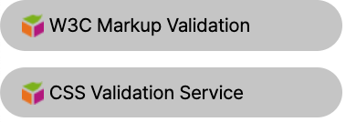
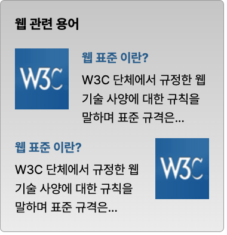

# Mission-01

**Index**

- [Info](#info)
- [Image](#image)
- [Desc](#desc)
  - [background](#background-과제)
  - [float](#float-과제)

## Info

1. background 과제

2. float 과제

## Image

## Desc

### background 과제

> background 과제 조건
>
> 1. 마크업 시 W3C Markup Validation / CSS Validation Service 등의 텍스트는 하이퍼링크 기능을 부여한다.
> 2. CSS를 활용하여 배경색, 배경이미지, 테두리 등 스타일링 지정한다. 이때 배경 영역이 모두 하이퍼링크 영역이 되도록 박스모델을 지정한다.
> 3. Cube 이미지는 반드시 CSS의 background 속성을 활용한다.

### float 과제

> float 과제 조건
>
> 1. 웹표준 이란? / 로고 이미지 / 설명 단락 영역은 반드시 정의형 목록 `dl` 요소로 마크업 한다.
> 2. W3C 로고 이미지는 `img` 요소를 사용하여 마크업 한다.
> 3. float 속성을 활용하여 디자인 시안 처럼 배치한다.
