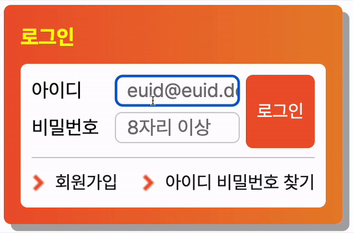

# Mission-02

## Info

position 실습을 위한 과제

2023.06.07 ~ 2023.06.09

## Image



## Markup

> **마크업 순서**
>
> 1. 로그인(제목)
> 2. 아이디 레이블과 입력서식
> 3. 비밀번호 레이블과 입력서식
> 4. 로그인 버튼
> 5. 회원가입 및 아이디/비밀번호 찾기 링크

```html
<div class="login__container">
  <h1 class="login__title">Title...</h1>
  <div class="login__wrapper">
    <div class="form__group">
      <form action="https://formspree.io/f/mnqykglp" method="POST">
        <fieldset>
          <legend>...</legend>
          <div>Id Input...</div>
          <div>Pwd Input...</div>
          <button class="form__submit" type="submit">Login...</button>
        </fieldset>
      </form>
    </div>
    <ul class="login__link">
      <li><a>Link...</a></li>
      <li><a>Link...</a></li>
    </ul>
  </div>
</div>
```

`<div class="login__container">`는 전체적인 레이아웃을 담는 container이며, 자식으로 타이틀인 `h1`과 로그인 `form`과 링크들이 담겨있는 `<div class="login__wrapper">`를 가지고 있다.

`<div class="form__group">`는 `form` 요소들을 모두 포함하는 박스이며 버튼의 `position` 기준을 담당한다. <br>
자식인 `form` 안에는 `fildset`이 `legend`, Id를 담당하는 `input`과 Pwd를 담당하는 `input`이 담긴 `div` 그리고 `submit`을 담당하는 `button`을 가지고 있다.

`<div class="form__group">`의 형제로 `<ul class="login__link">`가 존재하는데, 각각 회원가입과 아이디/비밀번호 찾기를 담당하는 `li` 요소안에 `a` 요소로 포함되어 있다.

<br>

**Input validation**

- Id
  - type="email"
  - required
- Password
  - type="password"
  - required
  - minlength="8"

## CSS

> **CSS 조건**
>
> 1. 일부 요소의 배치를 position 속성을 활용하여 구현
> 2. 회원가입, 아이디/비밀번호 찾기 영역은 float을 활용하여 구현

### 로그인 버튼을 position을 활용하여 구현하기.

`<div class="form__group">`에 `position: relative;` 속성을줌으로써 `<button class="form__submit" type="submit">`가 `<div class="form__group">`를 기준으로 위치를 잡도록 하였다.

```css
.form__group {
  position: relative;
}
.form__submit {
  position: absolute;
  top: 0;
  right: 0;
}
```

### 회원가입과 아이디/비밀번호 찾기 링크를 float을 활용하여 구현하기.

첫번째 요소인 `.login__link li:first-child`는 `float: left;`를 활용하여 좌측으로, <br>
두번째 요소인 `.login__link li:last-child`는 `float: right;`를 활용하여 우측으로 배치하고 <br>
부모 요소인 `.login__link`와 가상 요소 선택자 `::after`를 결합하여 `float`을 clear 시켰다.

```css
.login__link::after {
  content: "";
  display: block;
  clear: both;
}
.login__link li:first-child {
  float: left;
}
.login__link li:last-child {
  float: right;
}
```

**`label` 크기 조정과 정렬하기.**

따라서 `inline` 처럼 줄바꿈이 없고 `block`처럼 크기와 여백을 줄 수 있는 `inlin-block`로 지정해 주었다.

```css
.form__label {
  display: inline-block;
}
```
