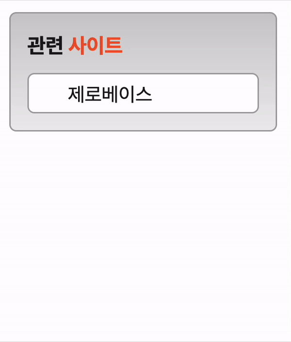

# Mission-03

**Index**

- [Info](#info)
- [Image](#image)
- [Desc](#desc)
  - [HTML](#html)
  - [CSS](#css)

## Info

transition 실습을 위한 과제

2023.06.09 ~ 2023.06.12

## Image



## Desc

### HTML

> **마크업 순서**
>
> 1. 관련 사이트는 제목으로 각각 항목은 링크로 구현한다.

#### Markup 구조

```
<body>
  <!-- 전체 컨테이너 -->
  <section class="related-container">
    <!-- 제목 -->
    <h2 class="title">...<span class="title-subText">...</span></h2>
    <!-- 관련 사이트 -->
    <ul class="related-site__list">
      <li><a>...</a></li>
      <li><a>...</a></li>
      <li><a>...</a></li>
      <li><a>...</a></li>
      <li><a>...</a></li>
    </ul>
  </section>
</body>
```

`<section class="related-container">` 요소 안에 제목인 `<h2 class="title">` 요소와 관련 사이트 리스트들의 부모인 `<ul class="related-site__list">` 요소가 포함되어 있다.

`<h2 class="title">` 요소 안에는 텍스트 디자인을 위해 `<span class="title-subText">` 요소를 포함 시켰다.

`<ul class="related-site__list">` 요소 안에는 각각의 링크들을 포함하기 위해 `<li>` 요소 안에 `<a>` 요소를 각각 포함 시켰다.

### CSS

> **CSS 조건**
>
> 1. 링크 목록은 5개이지만 화면에 1개의 목록만 보이도록 구현한다.
> 2. 목록에 마우스를 올리면 5개의 목록이 펼쳐지도록 구현한다.
> 3. transition 속성을 활용하여 애니메이션 효과를 적용한다.

#### `overflow: hidden`을 이용한 목록 숨기기

사용자가 마우스가 올리기 전에는 전체 목록들이 보이지 않고, 1개의 목록만 보이게 하게 위해서 `height` 값을 고정시키고 `overflow` 속성의 `hidden`
값을 이용해서 나머지 목록들을 숨김 처리했다.

```css
.related-site__list {
  list-style: none;
  border: 1px solid #a3a3a3;
  border-radius: 5px;
  background: #fff;
  width: 166px;
  height: 29px;
  overflow: hidden;
}
```

#### 가상 클래스 `:hover`를 이용해 숨겨진 목록 펼치기

사용자가 링크 요소들의 부모 요소인 `<ul class="related-site__list">`에 마우스를 올리면 컨테이너가 펼쳐져 전체 리스트들이 보이도록 가상 클래스 `:hover`를 이용하여 `height` 값을 늘려주었다.
또한 전체 리스트들이 담긴 컨테이너가 펼쳐진 다음 일어날 리스트들의 움직임을 위해 `padding-top` 값을 조절해 주었다.

```css
.related-site__list:hover {
  height: 169px;
  padding-top: 12px;
}
```

#### `transition` 속성을 이용하여 애니메이션 효과 적용하기

위 예제에서 사용자가 `ul` 요소에 마우스를 올릴때 `padding` 값과 `height` 값 변동이 부드럽지 않다.
이를 위해 `transition` 속성을 적용해준다. 이때 `transition` 속성을 적용해줄 요소를 잘 생각해보아야한다.

```css
.related-site__list {
  ...

  transition: padding-top 0.3s 0.3s, height 0.3s;
}
```

`transition: padding-top 0.3s 0.3s, height 0.3s;`
속성의 값을 살펴보면 단축 속성을 이용했는데, 각각의 애니메이션 효과를 따로 적용하는 것이 아닌 세번째 값인 `transition-delay`를 이용해 두가지 애니메이션이 각자 다른 시간에 일어날 수 있도록 하였다.

#### Etc style
