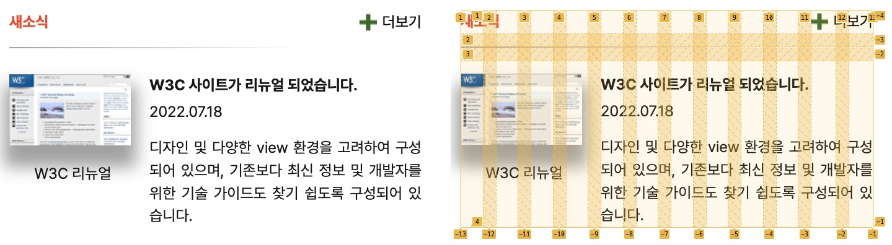

# Mission-04

**Index**

- [Info](#info)
- [Image](#image)
- [Desc](#desc)
  - [HTML](#html)
  - [CSS](#css)

## Info

grid 실습을 위한 과제

2023.06.12 ~ 2023.06.14

## Image



## Desc

### HTML

> **마크업 순서**
>
> 1. 이미지는 “W3C 리뉴얼”이라는 캡션 위에 썸네일 이미지를 사용한다. <br>
>    (해당 이미지는 배경으로 지정하지 말고  요소를 사용하여 콘텐츠 이미지로 배치)

#### Markup 구조

```html
<section class="news-wrapper">
  <h2 class="news-title">...</h2>
  <div class="news-more-wrapper">
    <a>...</a>
  </div>
  <div class="line-box" aria-label="구분선"></div>
  <figure class="news-thumbnail-wrapper">
    
    <figcaption>...</figcaption>
  </figure>
  <div class="news-contents">
    <h3>...</h3>
    <p>...</p>
    <p>...</p>
  </div>
</section>
```

부모인 `<section class="news-wrapper">` 요소는 자식들의 레이아웃을 담당해 줄 grid 컨테이너이고,

1. 자식으로 section의 제목을 담당할 `<h2 class="news-title">`
2. 더보기 링크를 담당할 `<div class="news-more-wrapper">`
3. 구분선을 담당할 빈 박스인 `<div class="line-box" aria-label="구분선">`
   - 스크린 리더 등 보조 기기를 이용하는 사용자에게 해당 영역이 "구분선"이라고 전달하기 위해 비어있는 `div`요소에 `aria-label` 속성을 사용했다.
4. 썸네일 이미지와 이미지에 대한 설명을 담당하는 `<figure class="news-thumbnail-wrapper">`
5. 새 소식의 텍스트 컨텐츠를 담당하는 `<div class="news-contents">`

위와 같이 크게 5가지의 요소들로 구성되어 있다.

### CSS

> **CSS 조건**
>
> 1. grid를 활용하여 레이아웃을 구현한다.

#### grid를 활용한 레이아웃 구현하기.

부모가 되는 `<section class="news-wrapper">` 요소에 display 속성을 grid로 지정해주고 각각의 요소들에게는 영역의 이름을 설정해주었다.

레이아웃을 동일한 비율로 12컬럼 그리드로 구성하기 위해 `grid-template-columns: repeat(12, 1fr);`를 사용했으며, <br>
컨텐츠의 크기에 따라 행의 크기가 설정 되도록 `grid-template-rows: auto;`를 사용해주었다.

`grid-template-areas` 속성을 이용해 각각의 요소들을 피그마 시안과 동일하게 배치했다.

```css
.news-wrapper {
  display: grid;
  grid-template-columns: repeat(12, 1fr);
  grid-template-rows: auto;
  grid-template-areas:
    "title title . . . . . . . . more more"
    "lineBox lineBox lineBox lineBox lineBox lineBox lineBox lineBox lineBox . . ."
    "thumb thumb thumb thumb newsContents newsContents newsContents newsContents newsContents newsContents newsContents newsContents";
}
.news-title {
  grid-area: title;
}
.news-more-wrapper {
  grid-area: more;
}
.line-box {
  grid-area: lineBox;
}
.news-thumbnail-wrapper {
  grid-area: thumb;
}
.news-contents {
  grid-area: newsContents;
}
```

#### Etc

**`text-align: justify`**

`<div class="news-contents">`의 마지막 문단에 텍스트 간격을 피그마 시안과 동일하게 양쪽에 맞추도록 정렬하였다.

**더보기 링크 정렬하기**

`<div class="news-more-wrapper">` 자식의 `a` 요소는 `img` 요소와 텍스트를 포함하고 있는데, 이를 정렬하기 위해 부모인 `a` 요소에 `display` 속성을 `flex`로 지정해 정렬해 주었다.

```css
.news-more-wrapper a {
  text-decoration: none;
  color: inherit;
  display: flex;
  justify-content: space-between;
  align-items: center;
}
```
