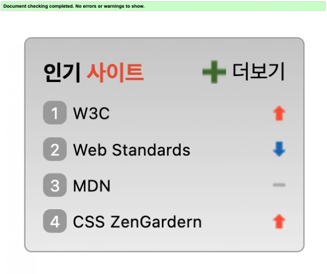

# Mission-05

**Index**

- [Info](#info)
- [Image](#image)
- [Desc](#desc)
  - [HTML](#html)
  - [CSS](#css)

## Info

sprite image 실습을 위한 과제

2023.06.14 ~ 2023.06.16

## Image



## Desc

### HTML

> **마크업 순서**
>
> 1. 인기 사이트의 리스트는 순서 목록 `ol` 요소를 사용한다.

#### Markup 구조

```html
<section class="favorite">
  <h2 class="favorite__title">...<span class="accentFavorite">...</span></h2>
  <ol class="favorite__list">
    <li class="favorite__item sprite sprite-up">
      <a class="favorite__link" href="/" target="_blank" rel="noopener noreferrer">...</a>
    </li>
    <li class="favorite__item sprite sprite-down">
      <a class="favorite__link" href="/" target="_blank" rel="noopener noreferrer">...</a>
    </li>
    <li class="favorite__item sprite sprite-no">
      <a class="favorite__link" href="/" target="_blank" rel="noopener noreferrer">...</a>
    </li>
    <li class="favorite__item sprite sprite-up">
      <a class="favorite__link" href="/" target="_blank" rel="noopener noreferrer">...</a>
    </li>
  </ol>
  <a class="favorite__more" href="#">...</a>
</section>
```
부모 요소인 `<section class="favorite">` 안에는
1. 제목을 담당하는 `<h2 class="favorite__title">` 요소
2. 인기 사이트들의 리스트를 담당하는 `<ol class="favorite__list">` 요소 
3. 더보기 링크를 담당하는 `<a class="favorite__more" href="#">` 요소

로 크게 3가지 요소로 구성되어 있다.

제목을 담당하는 `<h2 class="favorite__title">` 요소 안에는 색상 디자인을 위해 `<span class="accentFavorite">` 요소가 포함되어있다.

순차 목록 요소인 `<ol class="favorite__list">` 안에는 리스트 아이템인 `<li class="favorite__item sprite sprite-up">` 자식으로 `<a class="favorite__link" href="/" target="_blank" rel="noopener noreferrer">` 요소가 포함되어 있다. <br>
이때 다른 사이트로 이동을 위해 새 창으로 열리는  속성인 `target="_blank"`를 지정해 주었고, 보안 이슈 해결을 위한 속성인 `rel="noopener noreferrer"`를 지정해 주었다.


### CSS

> **CSS 조건**
>
> 1. 이미지를 활용하여 스프라이트 기법으로 스타일링 한다.
> 2. `ol` 요소가 제공하는 기본 숫자를 보이지 않도록 한 후 CSS로 구현한다.


#### sprite 기법으로 이미지 삽입하기.

`li` 요소에 모듈화한 `class="sprite"`를 이용해 배경 이미지를 삽입하고, 이미지를 반복시키지 않으며 가장 우측에서 이미지가 나타날 수 있게 x축의 초기값을 100%, 즉 `right`로 지정해주었다.

이후 필요한 각각의 이미지에 대해서는 `background-position-y` 속성을 이용해 위치를 지정해주었다.

```css
.sprite {
  background: url(./images/rank.png) no-repeat 100% 0;
}
.sprite-up {
  background-position-y: 3px;
}
.sprite-down {
  background-position-y: -42px;
}
.sprite-no {
  background-position-y: -19px;
}
```

#### `ol` 기본 숫자 제거 후 CSS로 구현하기.

순서 목록의 순서 값을 디자인하고 넘버링하기 위해 `ol` 요소가 제공하는 기본 숫자를 제거 후 가상 요소 `::before`를 이용하였다.

이때 자동 넘버링을 위한 `counter` 함수를 사용하기 위해  `counter-reset` 속성을 사용하여 카운터로 사용할 이름을 지정해주었고 숫자값을 입력하지 않음으로 초기값을 기본값인 0으로 지정하였다.

`counter-increment` 속성을 이용해 증가할 카운터의 이름을 선언하고 숫자값을 입력하지 않음으로써 증가값을 기본값인 1로 지정해주었다.

이후 `.favorite__item::before` 요소의 `content` 값으로 `counter(ranking)`를 입력함으로써 자동으로 순차적인 넘버링이 되게 하였다.

```css
.favorite__list {
  counter-reset: ranking;
  list-style: none;
}
.favorite__item {
  counter-increment: ranking;
}
.favorite__item::before {
  content: counter(ranking);
  font-size: 11px;
  background: #a3a3a3;
  color: #fff;
  display: inline-block;
  width: 16px;
  height: 16px;
  text-align: center;
  border-radius: 5px;
  margin-right: 4px;
}
```

#### Etc

**더보기 링크 위치 지정하기.**

마크업시 더보기 링크을 가장 마지막으로 마크업을 하였음으로 `position` 속성을 통해 위치를 지정해 주었다.
부모인 `<section class="favorite">` 요소에 `position: relative;`를 지정해주어 기준을 잡아주고 더보기 링크에 `position: absolute;`를 지정해주어 위치를 잡아주었다.

```css
.favorite {
  position: relative;
}
.favorite__more {
  position: absolute;
  top: 12px;
  right: 12px;
}
```

**링크 요소를 전체 너비로 지정하기.**

`<a class="favorite__link" href="/" target="_blank" rel="noopener noreferrer">` 요소의 링크될 공간의 너비값을 부모 요소 너비의 전체로 지정하기 위해서 `display` 속성의 값을 `inline-block`로 지정해주고, 너비값을 부모의 100%에서 넘버링된 `::before`요소의 컨텐츠 영역의 너비값 만큼 빼주었다.

```css
.favorite__link {
  display: inline-block;
  width: calc(100% - 16px - 4px);
}
```